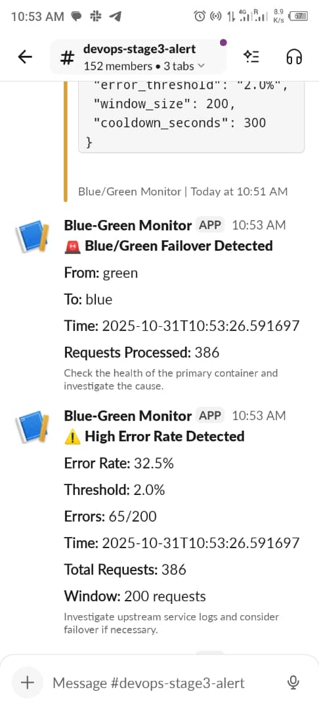
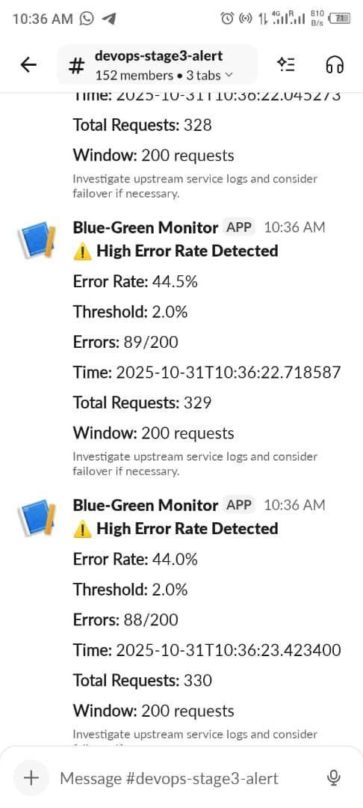

# Blue/Green Deployment with Monitoring & Alerting.

A production-ready Blue/Green deployment system with automatic failover, real-time monitoring, and Slack alerts. Features zero-downtime deployments, chaos engineering testing, and comprehensive operational visibility.

 ## Quick Setup
Prerequisites.
Docker & Docker Compose

Ubuntu 20.04+ server (or any Linux with Docker)

Slack workspace (for alerts)

1. Clone & Configure

# Clone the repository
git clone https://github.com/your-username/hng-devops-stage3
cd blue-green-monitoring

# Make scripts executable
chmod +x entrypoint.sh test-setup.sh test-failover.sh

# Create environment file
sudo nano .env

2. Configure Slack Integration

Go to api.slack.com/apps

Click "Create New App" → "From scratch"

Name: Blue-Green Monitor → Choose workspace

Go to "Incoming Webhooks" → Turn "Activate Incoming Webhooks" ON

Click "Add New Webhook to Workspace" → Choose channel (#alerts recommended)

Copy the webhook URL and add to .env:

# Edit .env file
nano .env

# Update this line with your actual webhook:
SLACK_WEBHOOK_URL=https://hooks.slack.com/services/your/actual/webhook/url

3. Deploy with Docker Compose

# Start all services
docker-compose up -d

# Or use the failover script (recommended)
./test-failover.sh

# Verify all services are running
docker-compose ps

Expected Output:

NAME                      STATUS              PORTS
blue-green-nginx-1        Up                  0.0.0.0:8080->80/tcp
blue-green-app_blue-1     Up                  0.0.0.0:8081->3000/tcp  
blue-green-app_green-1    Up                  0.0.0.0:8082->3000/tcp
blue-green-alert_watcher-1 Up                 

# Chaos Testing & Verification.

# 1. Check initial state (should be Blue)
curl -I http://localhost:8080/version
# Look for: X-App-Pool: blue

# 2. Induce failure on Blue
curl -X POST http://localhost:8081/chaos/start?mode=error

# 3. Wait 3 seconds and verify failover
sleep 3
curl -I http://localhost:8080/version
# Should show: X-App-Pool: green

# 4. Stop chaos and verify recovery
curl -X POST http://localhost:8081/chaos/stop
sleep 3
curl -I http://localhost:8080/version
# Should return to: X-App-Pool: blue

# Automated Testing.

# Run comprehensive test suite
./complete-failover.sh

# Test with specific host
./complete-failover.sh your-server-ip

# Testing Error Rate Alerts.

# Generate high error rate to trigger alerts
for i in {1..100}; do
    curl -s http://localhost:8080/version > /dev/null
    # Trigger errors periodically
    if [ $((i % 8)) -eq 0 ]; then
        curl -s -X POST http://localhost:8081/chaos/start?mode=error > /dev/null
        sleep 0.1
        curl -s -X POST http://localhost:8081/chaos/stop > /dev/null
    fi
    sleep 0.2

    done

# Verifying Slack Alerts.

1. Failover Alert 

🚨 Blue/Green Failover Detected

From: blue
To: green
Time: 2025-10-30T10:00:00
Requests Processed: 150

Check the health of the primary container and investigate the cause.

2. Error Rate

⚠️ High Error Rate Detected

Error Rate: 5.2%
Threshold: 2.0%
Errors: 13/200
Time: 2025-10-30T10:05:00
Total Requests: 450
Window: 200 requests

Investigate upstream service logs and consider failover if necessary.

## Testing Slack Integration

# Test Slack webhook manually
curl -X POST -H 'Content-type: application/json' \
  --data '{"text":"Test alert from deployment"}' \
  https://hooks.slack.com/services/your/webhook/url